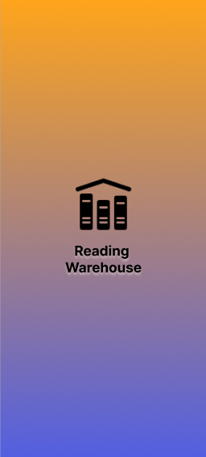

# Reading Warehouse

This application is a part of final group project for DSA-444 Application Mobile Development subject by TNIC students.
<center>



</center>

## Table of Contents
- [Project Title](#project-title)
    - [Table of Contents](#table-of-contents)
    - [Description](#description)
    - [Features](#features)
    - [Installation](#installation)
    - [Usage](#usage)
    - [Contributing](#contributing)
    - [License](#license)

## Description

The objective of this application is to help the user who likes reading books
and also likes to spend time in the book fair, but facing various problems such as
don't know to actual book price, forget what books that planning to buy,
moreover, forget to buy the book they already have.

## Features

- **MyShelf:** Store the book thar they read in their database
- **To Buy:** Making To buy list to check what they want to buy at the book fiar
- **Calculator:** to calculate the discount price form the percent discount label
- **Scanning:** A feature, to Scan and store book data in the database. Also, this feature compare the resut with the database to show that you have already buy it or it is in the to buy list


## Installation

This guide will walk you through the steps to install and run the Android application built with Kotlin.

### Prerequisites

Before you begin, ensure you have the following installed on your development machine:

- Android Studio (latest version recommended)
- Android SDK
- JDK (Java Development Kit)
- Git (optional, for cloning the repository)

### Installation Steps

1. **Clone the Repository**:
   ```bash
   git clone https://github.com/voravarun/ReadingWarehouse.git

2. **Open the Project in Android Studio:**
    <p>Launch Android Studio.
    Select "Open an existing Android Studio project."
    Navigate to the directory where you cloned the repository and select it.
    Android Studio will import the project.</p>

3. **Build and Run the Application:**
    <p>Once the project is loaded, wait for Android Studio to sync and build the project.
    Connect an Android device to your computer via USB or start an Android emulator from Android Studio.
    Select the target device/emulator from the device dropdown menu.<br>
    Click on the green "Run" button (or press Shift + F10) to build and run the application on the selected device/emulator.</p>

## Usage

To use the application, follow these steps:

- **Add Books to MyShelf:**
  Navigate to the MyShelf section.
  Use the option to add books that you have read to your database.

- **Create To-Buy Lists:**
  Go to the To Buy section.
  Create lists of books you want to buy at the book fair.

- **Calculate Discounts:**
  Utilize the Calculator feature to calculate discounted prices based on percent discounts.

- **Scan Books:**
  Use the scanning feature to scan and store book data in the database.
  This feature also checks if the book is already purchased or in the to-buy list.

- **Home:**
  Navigate back to the home page

## Contributing

We welcome contributions from the community. If you'd like to contribute to the project, please follow these steps:

1. Fork the repository.
2. Create a new branch for your feature or bug fix.
3. Make your changes and commit them.
4. Push your changes to your fork.
5. Submit a pull request with a detailed description of your changes.

## License

This project is licensed under the [GNU Affero General Public License](https://www.gnu.org/licenses/agpl-3.0.html).
